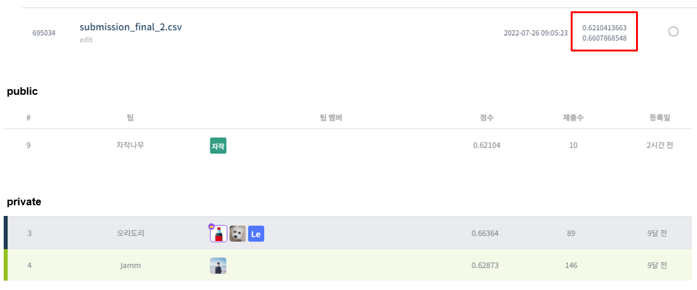

# 주차수요 예측 AI 경진대회

# 결과
---
### 요약정보
<ul>
    <li>도전기관:시큐레이어</li>
    <li>도전자:김택완</li>
    <li>최종스코어:0.621</li>
    <li>제출일자:2022-07-26</li>
    <li>총 참여 팀 수:189</li>
    <li>순위 및 비율:9(4.76%)</li>
</ul>

# 결과화면
---


# 사용한 방법 & 알고리즘
---
<ul>
    <li>상관관계를 통한 feature extraction</li>
    <li>MinMax Scaler</li>
    <li>Stacked RNN model 사용</li>
    <li>Bidirectional LSTM model 사용</li>
    <li>최종 모델 LSTM 사용</li>
</ul>

# 코드
---
[소스 코드](lstm_seculayer.ipynb)
# 참고자료
---

```python

```
