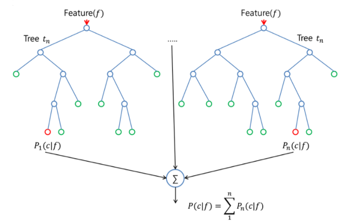

## KNOW기반 직업 추천 알고리즘 경진대회

------------

### 결과

----------------

### 결과 요약

* 도전기관 : 시큐레이어
* 도전자 : 허인
* 최종스코어 : 0.37487
* 제출일자 : 2022-01-05
* 총 참여 팀 수 : 905
* 순위 및 비율 :  141(15.58%)

### 리더보드

----------

### 알고리즘 & 문제 해결 방법

1. 알고리즘
* ensemble (지도학습) 머신러닝 모델: 여러 개의 decision tree를 결합하는 것이 더 좋은 결과, 성능을 낸다는 아이디어에서 착안
  
  * Classify: 여러 트리 형성 후 도출된 결과 -> 빈도수가 가장 높은 예측값을 최종 결론으로 선택. 
    ex. 8개의 트리를 형성하고 나온 예측값이 5개가 very good이라면, 예측값은 'very good'으로 분류
 * Logistic Regression의 주요 parameters
   * fit_intercept: 상수 추가 여부 - True, False
   * random_state: 데이터 섞을 때 사용하는 RANDOM NUMBER SEED 값
   * solver: 최적화에 사용할 알고리즘 결정
   * n_jobs: 병렬처리 시 이용할 CPU 코어 수
 * RandomForest Classifier의 주요 parameters
   * n_estimator(트리의 수): 트리의 수가 많다는 것은 경우의 수가 많다는 것 -> 트리의 수가 클수록 좋음
   * max_features(나누는 수) 
   * 작은 max_features와 큰 n_estimator는 과적합(overfit) 감소시킨다는 장점이 있음 
 * DecisionTree Classifier의 주요 parameters
   * random_state: 데이터 섞을 때 사용하는 RANDOM NUMBER SEED 값
    
 
 2. 문제 해결 방법
 * data 전처리
   * LabelEncoding
 * modeling (모델 정의 및 모델 학습): HardVoting Classifier
   * Logistic Regression
   * RandomForest Classifier
   * DecisionTree Classifier
 * test data 예측 -> model로 test data predict

-----------

### 코드

['./KNOW기반 직업 추천 알고리즘 경진대회.ipynb](https://github.com/gjdls01/seculayer_challenge3/blob/main/dacon/KNOW%EA%B8%B0%EB%B0%98%20%EC%A7%81%EC%97%85%20%EC%B6%94%EC%B2%9C%20%EC%95%8C%EA%B3%A0%EB%A6%AC%EC%A6%98%20%EA%B2%BD%EC%A7%84%EB%8C%80%ED%9A%8C/KNOW%EA%B8%B0%EB%B0%98%20%EC%A7%81%EC%97%85%20%EC%B6%94%EC%B2%9C%20%EC%95%8C%EA%B3%A0%EB%A6%AC%EC%A6%98%20%EA%B2%BD%EC%A7%84%EB%8C%80%ED%9A%8C.ipynb)

-----------

### 참고자료

[Voting Classifier](https://www.codingninjas.com/codestudio/library/the-voting-classifier)
[RandomForest Classifier](https://scikit-learn.org/stable/modules/generated/sklearn.ensemble.RandomForestClassifier.html#:~:text=A%20random%20forest%20classifier.%20A%20random%20forest%20is,to%20improve%20the%20predictive%20accuracy%20and%20control%20over-fitting.)

