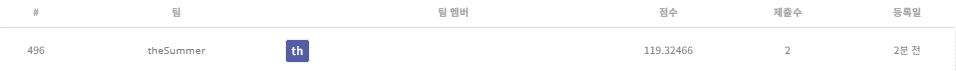
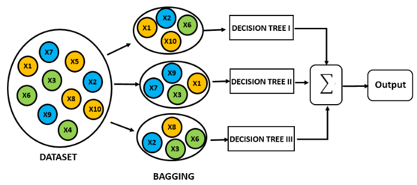

## 구내식당 식수 인원 예측 AI 경진대회

------------

### 결과

----------------

### 결과 요약

* 도전기관 : 시큐레이어
* 도전자 : 허인
* 최종스코어 : 119.32466
* 제출일자 : 2022-01-03
* 총 참여 팀 수 : 1573
* 순위 및 비율 :  496(31%)

### 리더보드

----------

### 알고리즘 & 문제 해결 방법

1. 알고리즘
* Random Forest
  * ensemble (지도학습) 머신러닝 모델: 여러 개의 decision tree를 결합하는 것이 더 좋은 결과, 성능을 낸다는 아이디어에서 착안
  
   - Bagging (Bootstrap Aggregating): 여러 개의 트리를 생성하는데, 각 트리 생성 시 training set에 대하여 임의로 n개의 데이터를 선택. 이때 데이터 중복 허용(with replacement)
     
   - Bagging Features: Feature 선택 시 feature의 부분집합 활용. 일반적으로 M개의 feature가 있다면, 루트 M개의 feature를 선택. 이후 information gain이 높은 feature 선택
   - Classify: 여러 트리 형성 후 도출된 결과 -> 빈도수가 가장 높은 예측값을 최종 결론으로 선택.
     -- ex. 8개의 트리를 형성하고 나온 예측값이 5개가 very good이라면, 예측값은 'very good'으로 분류
  
 
 2. 문제 해결 방법
 * data 전처리: column '요일'을 숫자로 mapping -> categorical data만 feature로 선택
 * modeling (모델 정의 및 모델 학습) -> RandomForestRegressor으로 모델 정의 및 train data에 대하여 모델 학습
 * test data 예측 -> RandomForest Regressor으로 test data predict

-----------

### 코드

['./구내식당 식수 인원 예측 AI 경진대회.ipynb](https://github.com/gjdls01/AutoAPE-challenge3/blob/main/dacon/%EA%B5%AC%EB%82%B4%EC%8B%9D%EB%8B%B9%20%EC%8B%9D%EC%88%98%20%EC%9D%B8%EC%9B%90%20%EC%98%88%EC%B8%A1%20AI%20%EA%B2%BD%EC%A7%84%EB%8C%80%ED%9A%8C/%EA%B5%AC%EB%82%B4%EC%8B%9D%EB%8B%B9%20%EC%8B%9D%EC%88%98%20%EC%9D%B8%EC%9B%90%20%EC%98%88%EC%B8%A1%20AI%20%EA%B2%BD%EC%A7%84%EB%8C%80%ED%9A%8C.ipynb)

-----------

### 참고자료

[RandomForest](https://medium.com/greyatom/a-trip-to-random-forest-5c30d8250d6a)
