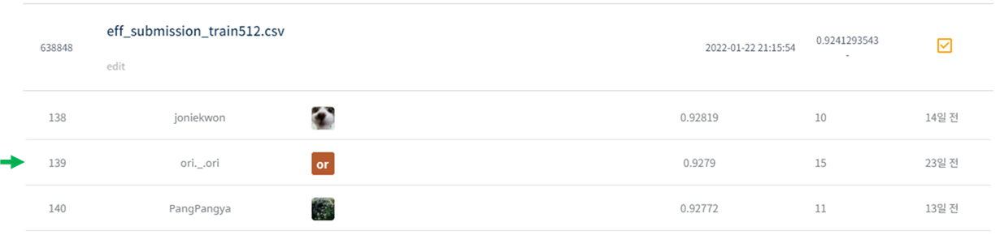
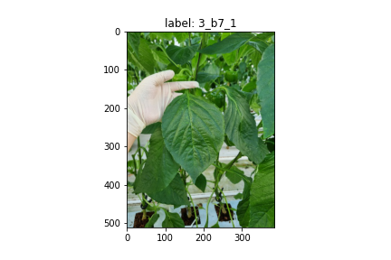
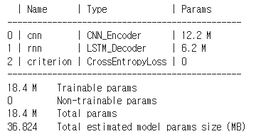

# 농업 환경 변화에 따른 작물 병해 진단 AI 경진대회

## 결과

### 요약정보

- 도전기관 : 시큐레이어
- 도전자 : 노민주
- 최종스코어 : 0.9279
- 제출일자 : 2022-02-21
- 총 참여 팀 수 : 1491
- 순위 및 비율 : 139(9.56%)

### 결과화면

## 사용한 방법 & 알고리즘

병해 피해를 입은 작물 사진, 환경 데이터를 이용해 병해를 예측하는 대회이다.

### DATA

train dataset은 총 5767장이다. train dataset마다 이미지 파일(png), 환경데이터(csv), 이미지 정보(json)가 있다.

이미지와 환경데이터 모두 활용하기 위해서 이미지 분류 모델, 시계열 모델 모두 사용하였다.

- Train image augmentation : (512,512)로 resize, data augmentaiton 진행
- Test Time Augmentation(TTA) : augmentation 진행한 이미지와 원본 이미지 둘 다 inference 후 평균

### Model
- EfficientNetB3 (CNN, 이미지 분류 모델)
- LSTM (RNN, 시계열 모델)

## 코드

[농업환경변화에_따른_작물병해진단_AI경진대회_train.ipynb](./농업환경변화에_따른_작물병해진단_AI경진대회_train.ipynb)

[농업환경변화에_따른_작물병해진단_AI경진대회_inf.ipynb](./농업환경변화에_따른_작물병해진단_AI경진대회_inf.ipynb)

## 참고 자료
