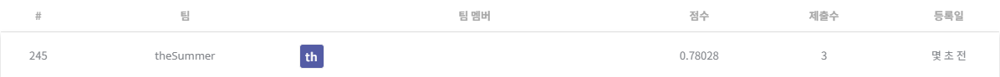
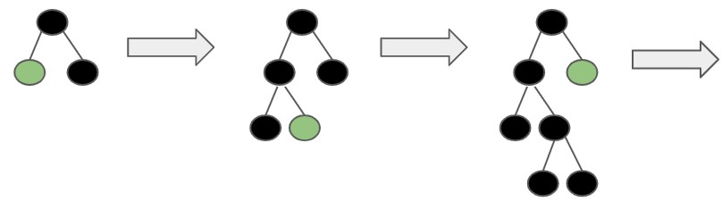

## 뉴스 토픽 분류 AI 경진대회

------------

### 결과

----------------

### 결과 요약

* 도전기관 : 시큐레이어
* 도전자 : 허인
* 최종스코어 : 0.78028
* 제출일자 : 2022-01-03
* 총 참여 팀 수 : 828
* 순위 및 비율 :  245(29%)

### 리더보드

----------

### 알고리즘 & 문제 해결 방법

1. 알고리즘
* LightGBM (Light Gradient descent Boosting Machine)
  * Light -> 빠른 속도 
  * GBM -> 잔여오차(residual error)
  * Tree 기반 학습 알고리즘 (Gradient Boosting Framework)
  * 수직 확장(leaf-wise). 반대는 수평 확장이라고 칭한다(level-wise)
  * 과적합에 민감하며, 작은 크기의 데이터는 과적합될 확률이 크기에 대용량의 데이터에 활용
  * parameter
    - max_depth/ min_data_in_leaf / feature_fraction/ bagging_fraction / early_stopping_round / lambda / min_gain_to_split / max_cat_group
    - objective: 회귀(regression), 분류(binary, multiclass)
  
  
 
 2. 문제 해결 방법
 * data 전처리
   * target('title')에서 불필요한 정보(조사, 어미, 구두점) 제거 -> 어간 추출
 * train / valid dataset split (80:20)
 * modeling (모델 정의 및 모델 학습) -> LightGBM으로 모델 정의 및 train data에 대하여 모델 학습, 평가
 * test data 예측 -> LightGBM으로 test data predict

-----------

### 코드

['./뉴스 토픽 분류 AI 경진대회.ipynb](https://github.com/gjdls01/AutoAPE-challenge3/blob/main/dacon/%EB%89%B4%EC%8A%A4%20%ED%86%A0%ED%94%BD%20%EB%B6%84%EB%A5%98%20AI%20%EA%B2%BD%EC%A7%84%EB%8C%80%ED%9A%8C/%EB%89%B4%EC%8A%A4%20%ED%86%A0%ED%94%BD%20%EB%B6%84%EB%A5%98%20AI%20%EA%B2%BD%EC%A7%84%EB%8C%80%ED%9A%8C.ipynb)

-----------

### 참고자료

[LightGBM](https://lightgbm.readthedocs.io/en/latest/)
