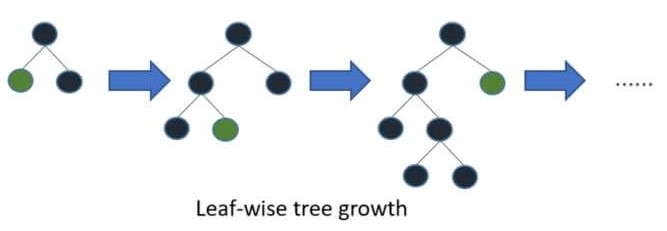

## 물류 유통량 예측 경진대회

------------

### 결과

----------------

### 결과 요약

* 도전기관 : 시큐레이어
* 도전자 : 허인
* 최종스코어 : 7.83695
* 제출일자 : 2022-01-03
* 총 참여 팀 수 : 469
* 순위 및 비율 :  241(51%)

### 리더보드

----------

### 알고리즘 & 문제 해결 방법

1. 알고리즘
* LabelEncoder
  * categorical data -> numerical data 

* LightGBM Regressor
  * Tree 기반 학습 알고리즘 (Gradient Boosting Framework)
  * 수직 확장(leaf-wise). 반대는 수평 확장이라고 칭한다(level-wise)
  * 과적합에 민감하며, 작은 크기의 데이터는 과적합될 확률이 크기에 대용량의 데이터에 활용
  * parameter: max_depth/ min_data_in_leaf / feature_fraction/ bagging_fraction / early_stopping_round / lambda / min_gain_to_split / max_cat_group
  
  
 
 2. 문제 해결 방법
 * data load
 * data 전처리 -> LabelEncoder 활용하여 categorical data인 column'물품_카테고리'를 numerical data로 변환
 * modeling (모델 정의 및 모델 학습) -> LightGBM으로 모델 정의 및 train data에 대하여 모델 학습
 * test data 예측 -> LightGBM으로 test data predict

-----------

### 코드

['./물류 유통량 예측 경진대회.ipynb](https://github.com/gjdls01/AutoAPE-challenge3/blob/main/dacon/%EB%AC%BC%EB%A5%98%20%EC%9C%A0%ED%86%B5%EB%9F%89%20%EC%98%88%EC%B8%A1%20%EA%B2%BD%EC%A7%84%EB%8C%80%ED%9A%8C/%EB%AC%BC%EB%A5%98%20%EC%9C%A0%ED%86%B5%EB%9F%89%20%EC%98%88%EC%B8%A1%20%EA%B2%BD%EC%A7%84%EB%8C%80%ED%9A%8C.ipynb)

-----------

### 참고자료

[LabelEncoder]
- [자료1](https://scikit-learn.org/stable/modules/generated/sklearn.preprocessing.LabelEncoder.html)
- [자료2](https://towardsdatascience.com/categorical-encoding-using-label-encoding-and-one-hot-encoder-911ef77fb5bd)
[LightGBM] 
- [자료1](https://lightgbm.readthedocs.io/en/latest/)
