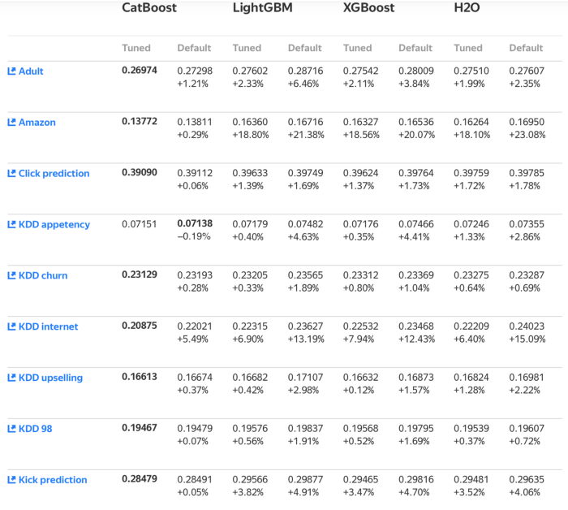

## 물류 유통량 예측 경진대회

------------

### 결과

----------------

### 결과 요약

* 도전기관 : 시큐레이어
* 도전자 : 허인
* 최종스코어 : 5.70357
* 제출일자 : 2022-01-12
* 총 참여 팀 수 : 520
* 순위 및 비율 :  150(29%)

### 리더보드

----------

### 알고리즘 & 문제 해결 방법

1. 알고리즘 및 주요개념
* CatBoost (Categorical Boosting)
  1) 특징
     * Level-wise Tree
     * ordered boosting
       - 기존의 부스팅 모델은 모든 훈련 데이터를 대상으로 잔차 계산을 실시한다
       - catboost는 일부 훈련 데이터를 대상으로 잔차 계산을 실시하고, 이것으로 모델을 만들어 예측을 한 뒤, 그 결과를 그 뒤의 데이터의 잔차에 사용한다 
         ex. 데이터 a,b,c...x,y,z가 있고 이에 각각 대응하는 값이 있다고 하자. 기존의 데이터는 a~z까지의 잔차를 한 번에 계싼한다. 그러나 catboost의 경우, a의 잔차를 우선적으로 계산한 뒤, 이를 기반으로 모델을 만든다. 그리고 이 모델을 활용해 b의 잔차를 예측한다
     * random permutation
       - 위의 ordered boosting 실시할 경우, 데이터 순서를 섞지 않으면 항상 같은 순서로 잔차를 예측한다. 따라서 catboost는 데이터를 섞어서 뽑는다
  2) 장점
     * parameter tuning을 하지 않아도 좋은 성능을 낸다
       - default parameter로 좋은 결과를 도출하기에, parameter tuning에 드는 시간 감소
     * categorical feature를 다룸
       - numerical feature가 아닌, non-numerical feature에 대해 잘 작동함
       - categorical feature를 labelEncode 하는 등의 시간 감소 
     * 높은 정확도
       - 과적합(overfit) 감소
     * 타 알고리즘에 비해 성능이 높은 것을 아래 그림을 통해 확인할 수 있음
    
  
 
 2. 문제 해결 방법
 * modeling (모델 정의 및 모델 학습)
   - catboost Regressor로 모델 정의 및 train data에 대하여 모델 학습
   - catboost를 활용하기 때문에 LabelEncoder를 활용하여 categorical data를 numerical data로 변환할 필요가 없다
 * test data 예측 -> catboost Regressor으로 test data predict

-----------

### 코드

['./물류 유통량 예측 경진대회.ipynb](https://github.com/gjdls01/AutoAPE-challenge3/blob/main/dacon/%EB%AC%BC%EB%A5%98%20%EC%9C%A0%ED%86%B5%EB%9F%89%20%EC%98%88%EC%B8%A1%20%EA%B2%BD%EC%A7%84%EB%8C%80%ED%9A%8C/%EB%AC%BC%EB%A5%98%20%EC%9C%A0%ED%86%B5%EB%9F%89%20%EC%98%88%EC%B8%A1%20%EA%B2%BD%EC%A7%84%EB%8C%80%ED%9A%8C.ipynb)

-----------

### 참고자료

[catboost]
 - 자료1(https://catboost.ai/)
 - 자료2(https://hanishrohit.medium.com/whats-so-special-about-catboost-335d64d754ae) 
