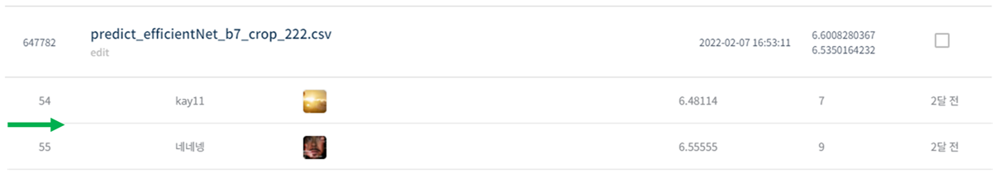
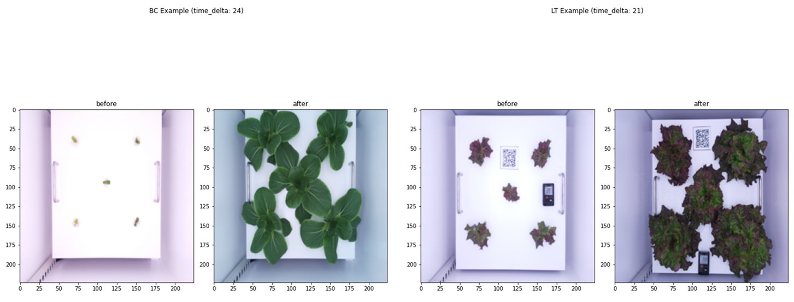
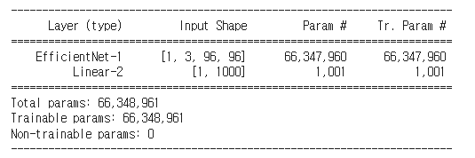

# 생육 기간 예측 경진대회

## 결과

### 요약정보

- 도전기관 : 시큐레이어
- 도전자 : 노민주
- 최종스코어 : 6.5855667601
- 제출일자 : 2022-02-07
- 총 참여 팀 수 : 510
- 순위 및 비율 : 55(10.78%)

### 결과화면

## 사용한 방법 & 알고리즘

한 쌍(before&after)의 이미지를 input으로 하여 식물의 생육 기간을 예측하는 대회이다.

### DATA

Train 폴더에는 BC(청경채)폴더와 LT(적상추) 폴더가 있다.

BC 폴더 안에 9개의 각각 다른 청경채의 날짜 별 이미지가 들어 있다. 대략 40일정도의 생육기간동안 촬영한 이미지가 있다.
마찬가지로 LC 폴더 안에 10개의 각각 다른 적상추의 날짜 별로 찍힌 이미지가 있다. 

총 train이미지는 753장이다. 같은 종류끼리 랜덤으로 2개의 이미지를 쌍으로 만들어 생육기간(time_delta)을 측정한 dataframe을 생성하여 trainset으로 사용한다. BC와 LT 각각 6000쌍을 만들었다.

Test 폴더는 BC폴더, LT폴더로 나누어져 있고, 각각의 폴더 안에 이미지가 있다. test_data.csv에 before file과 after file의 path가 적혀있고 총 3960쌍의 testset가 있다.

- 이미지 데이터 용량이 너무 커서 이미지 로드하기 전에 224x224 사이즈로 resize하였다.
- Train image augmentation: FiveCrop으로 한 이미지 당 96x96사이즈 5개의 이미지 생성 > top_left이미지만으로 훈련

### Model
- EfficientNetB7 + classifier 추가

## 코드
[생육 기간 예측 경진대회.ipynb](./생육_기간_예측_경진대회.ipynb)

## 참고 자료
