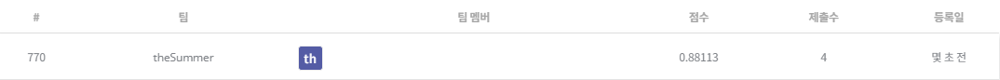

## 신용카드 사용자 연체 예측 AI 경진대회

------------

### 결과

----------------

### 결과 요약

* 도전기관 : 시큐레이어
* 도전자 : 허인
* 최종스코어 : 0.88113
* 제출일자 : 2022-01-04
* 총 참여 팀 수 : 2338
* 순위 및 비율 :  770(33%)

### 리더보드

----------

### 알고리즘 & 문제 해결 방법

1. 알고리즘 및 주요 개념
* KFold
  * train / validation set에 대하여 k개의 폴드 세트에 K번의 학습(train) 및 검증(validation)을 진행
  * train을 1회만 실시할 경우 과적합(overfit)할 가능성이 크기 때문에 교차 검증 실시
  * 한계: 레이블 값의 분포를 반영하지 못함 (데이터의 불균형성) 
    ex. Label A와 LabelB의 개수 비가 100:1 -> 불균형
 * StratifiedKFold
   * KFold의 한계(레이블 값의 분포 반영 못함)을 해결
   * 데이터 분포에 따라 train / validation dataset split
* Random Forest
  * ensemble (지도학습) 머신러닝 모델: 여러 개의 decision tree를 결합하는 것이 더 좋은 결과, 성능을 낸다는 아이디어에서 착안
    
    - Bagging (Bootstrap Aggregating): 여러 개의 트리를 생성하는데, 각 트리 생성 시 training set에 대하여 임의로 n개의 데이터를 선택. 이때 데이터 중복 허용(with replacement)
    
    - Bagging Features: Feature 선택 시 feature의 부분집합 활용. 일반적으로 M개의 feature가 있다면, 루트 M개의 feature를 선택. 이후 information gain이 높은 feature 선택
    - Classify: 여러 트리 형성 후 도출된 결과 -> 빈도수가 가장 높은 예측값을 최종 결론으로 선택. 
      ex. 8개의 트리를 형성하고 나온 예측값이 5개가 very good이라면, 예측값은 'very good'으로 분류
* log_loss (cross-entropy loss): 손실함수
  * 모델이 label 값을 예측할 확률을 이용하여 평가
  * log_loss가 낮을수록 좋은 성능을 보이는 것, 즉 예측을 잘한 것
    
 
 2. 문제 해결 방법
 * data 전처리
   * labelEncoder: categorical data -> numerical data
   * 연속형 변수(continuous variable) 구간화
 * modeling (모델 정의 및 모델 학습) -> RandomForestClassifier로 모델 정의 및 train data에 대하여 모델 학습
 * test data 예측 ->RandomForestClassifier로 test data predict

-----------

### 코드

['./신용카드 사용자 연체 예측 AI 경진대회.ipynb](https://github.com/gjdls01/AutoAPE-challenge3/blob/main/dacon/%EC%8B%A0%EC%9A%A9%EC%B9%B4%EB%93%9C%20%EC%82%AC%EC%9A%A9%EC%9E%90%20%EC%97%B0%EC%B2%B4%20%EC%98%88%EC%B8%A1%20AI%20%EA%B2%BD%EC%A7%84%EB%8C%80%ED%9A%8C/%EC%8B%A0%EC%9A%A9%EC%B9%B4%EB%93%9C%20%EC%82%AC%EC%9A%A9%EC%9E%90%20%EC%97%B0%EC%B2%B4%20%EC%98%88%EC%B8%A1%20AI%20%EA%B2%BD%EC%A7%84%EB%8C%80%ED%9A%8C.ipynb)

-----------

### 참고자료

[KFold](https://scikit-learn.org/stable/modules/generated/sklearn.model_selection.KFold.html)
[StratifiedKFold](https://scikit-learn.org/stable/modules/generated/sklearn.model_selection.StratifiedKFold.html)
[Log_loss](https://scikit-learn.org/stable/modules/generated/sklearn.metrics.log_loss.html)
