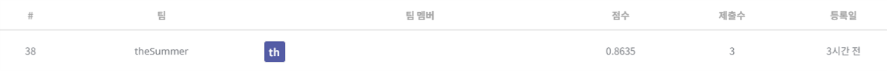
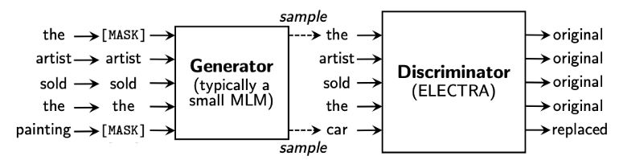

## 영화 리뷰 감성분석 경진대회

------------

### 결과

----------------

### 결과 요약

* 도전기관 : 시큐레이어
* 도전자 : 허인
* 최종스코어 : 0.8635
* 제출일자 : 2022-01-19
* 총 참여 팀 수 : 561
* 순위 및 비율 :  38 (7%)

### 리더보드

----------

### 알고리즘 & 문제 해결 방법

1. 알고리즘
* KcELECTRA (Korean comments ELECTRA)
  * 자연어 처리 분야에서 좋은 성능을 보여주는 모델 (한국어 성능 한계 개선) - 한국어 댓글을 이용하여 학습한 ELECTRA 모델
  * ELECTRA
    - 학습의 효율성을 위해 RTD 사용 
      - RTD: 일부 토큰을 Generator에서 얻은 가짜 토큰으로 치환 - Discriminator로 들어온 토큰이 실제 토큰인지, Generator을 통해 생성된 가짜 토큰인지 맞힘 
      - 모든 토큰에 대해 이진 분류를 해야 하기에 모든 토큰에 대하여 loss를 계산해야 함 (모든 토큰에 대해 학습하기에 효과적) 
         
     
 
 2. 문제 해결 방법
 * argument 설정
 * Pytorch Lightning 활용해서 모델 만들기
 * 학습
 * 예측
 
-----------

### 코드

['./주차수요 예측 AI 경진대회.ipynb](https://github.com/gjdls01/AutoAPE-challenge3/blob/main/dacon/%EC%A3%BC%EC%B0%A8%EC%88%98%EC%9A%94%20%EC%98%88%EC%B8%A1%20AI%20%EA%B2%BD%EC%A7%84%EB%8C%80%ED%9A%8C/%EC%A3%BC%EC%B0%A8%EC%88%98%EC%9A%94%20%EC%98%88%EC%B8%A1%20AI%20%EA%B2%BD%EC%A7%84%EB%8C%80%ED%9A%8C.ipynb)

-----------

### 참고자료

[KcELECTRA Github](https://link.ainize.ai/3ezh2SS)
