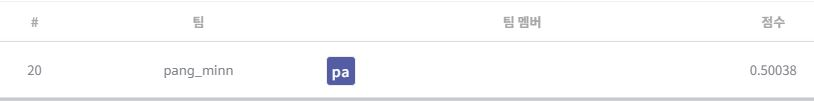

# 월간 데이콘 발화자의 감정인식 AI 경진대회
---
# 결과
---
### 요약 정보
* 도전기관 : 시큐레이어
* 도전자 : 이강민
* 최종 스코어 : 0.50038
* 제출 일자 : 2022-11-17
* 총 참여 팀수 : 406
* 순위 및 비율 : 20 (4.9%)

# 결과 화면
---


# 사용한 방법 & 알고리즘
---
* 발화자의 수, 총 담화 수, 감정의 종류 등을 파악
* BERT 계열 pre-trained 토크나이저들의 토큰화 방식 비교 후 사용
* BERT, EmoBERTa 모델 사용

# 코드
---
[jupyter notebook code](Speakers_emotion_recognition_monthly_Dacon-final.ipynb)

# 참고자료
---
##### https://www.dacon.io/competitions/official/236027/codeshare/6989?page=1&dtype=recent
##### https://arxiv.org/pdf/2108.12009.pdf

```python

```
