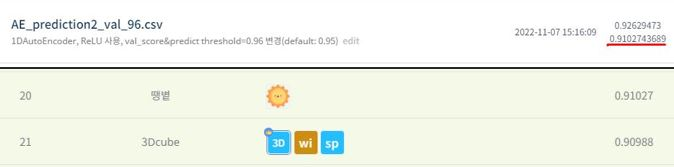

# 월간 데이콘 신용카드 사기 거래 탐지 AI 경진대회
---
# 결과
---
### 요약 정보
* 도전기관 : 시큐레이어
* 도전자 : 이강민
* 최종 스코어 : 0.91027
* 제출 일자 : 2022-11-07
* 총 참여 팀수 : 1561
* 순위 및 비율 : 21 (1.3%)

# 결과 화면
---


# 사용한 방법 & 알고리즘
---
* 각 feature와 label 간의 상관관계 분석
* 상관관계 분석에 따른 feature 선택
* 비지도학습 AutoEncoder 모델 사용

# 코드
---
[jupyter notebook code](Credit card fraud detection_monthly Dacon-final.ipynb)


# 참고자료
---
##### https://www.dacon.io/competitions/official/235930/codeshare/5508?page=2&dtype=recent


```python

```
