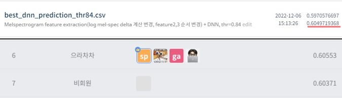

# 월간 데이콘 음향 데이터 COVID-19 검출 AI 경진대회
---
# 결과
---
### 요약 정보
* 도전기관 : 시큐레이어
* 도전자 : 이강민
* 최종 스코어 : 0.60497
* 제출 일자 : 2022-12-06
* 총 참여 팀수 : 645
* 순위 및 비율 : 7 (1.1%)

# 결과 화면
---



# 사용한 방법 & 알고리즘
---
* wav 데이터 분석: 기본 음파 그래프, Spectrogram, Mel-Spectrogram, Harmonic & Percussive 성분 파악
* wav 데이터 특성 추출: 다음 3가지 feature를 기존의 csv 데이터에 추가하여 데이터셋 구성
	- feature 1. melspectrogram(n_mels=16)
	- feature 2. melspectrogram(n_mels=16)의 델타
	- feature 3. harmonic & percussive의 평균(melspectrogram 활용, n_mels=16)
* DNN(Deep Neural Network) 모델 사용

# 코드
---
[jupyter notebook code](Audio_data_COVID-19_detection_monthly_Dacon_final.ipynb)

# 참고자료
---
##### https://scienceon.kisti.re.kr/commons/util/originalView.do?cn=JAKO202106355476877&dbt=JAKO&koi=KISTI1.1003%2FJNL.JAKO202106355476877
##### https://jonhyuk0922.tistory.com/114


```python

```
