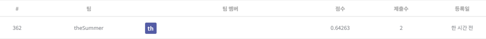

## 잡케어 추천 알고리즘 경진대회

------------

### 결과

----------------

### 결과 요약

* 도전기관 : 시큐레이어
* 도전자 : 허인
* 최종스코어 : 0.64263
* 제출일자 : 2022-01-24
* 총 참여 팀 수 : 1264
* 순위 및 비율 :  362(29%)

### 리더보드

----------

### 알고리즘 & 문제 해결 방법

1. 알고리즘
* Random Forest
  * ensemble (지도학습) 머신러닝 모델: 여러 개의 decision tree를 결합하는 것이 더 좋은 결과, 성능을 낸다는 아이디어에서 착안
    
    1) Bagging (Bootstrap Aggregating): 여러 개의 트리를 생성하는데, 각 트리 생성 시 training set에 대하여 임의로 n개의 데이터를 선택. 이때 데이터 중복 허용(with replacement)
    
       - Bagging Features: Feature 선택 시 feature의 부분집합 활용. 일반적으로 M개의 feature가 있다면, 루트 M개의 feature를 선택. 이후 information gain이 높은 feature 선택 
    2) Classify: 여러 트리 형성 후 도출된 결과 -> 빈도수가 가장 높은 예측값을 최종 결론으로 선택. 
      ex. 8개의 트리를 형성하고 나온 예측값이 5개가 very good이라면, 예측값은 'very good'으로 분류
    3) parameters:
        - n_estimator(트리의 수): 트리의 수가 많다는 것은 경우의 수가 많다는 것 -> 트리의 수가 클수록 좋음
        - max_features(나누는 수) 
        - 작은 max_features와 큰 n_estimator는 과적합(overfit) 감소시킨다는 장점이 있음 
    
 
 2. 문제 해결 방법
 * data 전처리
   * 기존의 변수 활용하여 새로운 변수 생성 (식수 인원 예측을 위해, 식사를 하는 인원 데이터 생성)
   * categorical data(요일)에 대하여 LabelEncoder 적용
   * 일자 데이터를 연도, 월, 일 데이터로 나누어 저장
 * modeling (모델 정의 및 모델 학습) -> RandomForestRegressor으로 모델 정의 및 train data에 대하여 모델 학습
   * 유의미한 정보를 담고 있지 않은 컬럼(조식 메뉴, 중식메뉴, 석식메뉴)는 feature select시 제외: 특정 메뉴가 반복되는 등의 패턴을 보이지 않아 무의미함
 * test data 예측 -> RandomForest Regressor으로 test data predict

-----------

### 코드

['./잡케어 추천 알고리즘 경진대회.ipynb](https://github.com/gjdls01/seculayer_challenge3/blob/main/dacon/%EC%9E%A1%EC%BC%80%EC%96%B4%20%EC%B6%94%EC%B2%9C%20%EC%95%8C%EA%B3%A0%EB%A6%AC%EC%A6%98%20%EA%B2%BD%EC%A7%84%EB%8C%80%ED%9A%8C/%EC%9E%A1%EC%BC%80%EC%96%B4%20%EC%B6%94%EC%B2%9C%20%EC%95%8C%EA%B3%A0%EB%A6%AC%EC%A6%98%20%EA%B2%BD%EC%A7%84%EB%8C%80%ED%9A%8C.ipynb)

-----------

### 참고자료

[RandomForest](https://medium.com/greyatom/a-trip-to-random-forest-5c30d8250d6a)
