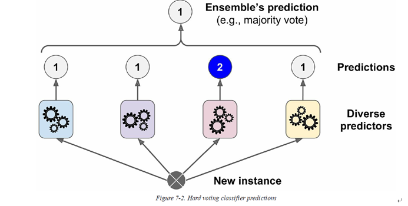

## 잡케어 추천 알고리즘 경진대회

------------

### 결과

----------------

### 결과 요약

* 도전기관 : 시큐레이어
* 도전자 : 허인
* 최종스코어 : 0.64263
* 제출일자 : 2022-01-24
* 총 참여 팀 수 : 1264
* 순위 및 비율 :  362(29%)

### 리더보드

----------

### 알고리즘

알고리즘
* XGBoost(Extreme Gradient Boosting) Classifier
  * Boosting: ensemble의 원리로 작동
    - ensemble (지도학습) 머신러닝 모델: 여러 개의 decision tree를 결합하는 것이 더 좋은 결과, 성능을 낸다는 아이디어에서 착안
      
      * Classify: 여러 트리 형성 후 도출된 결과 -> 빈도수가 가장 높은 예측값을 최종 결론으로 선택 
        ex. 8개의 트리를 형성하고 나온 예측값이 5개가 very good이라면, 예측값은 'very good'으로 분류

  * 장점
    - 속도 및 성능: 다른 ensemble classifier에 비해 속도가 빠르며 타 알고리즘에 비해 좋은 성능을 보임
    - tuning parameters의 다양성: cross-validation, regularization, 결측치, tree parameters
    

-----------

### 코드

['./잡케어 추천 알고리즘 경진대회.ipynb](https://github.com/gjdls01/seculayer_challenge3/blob/main/dacon/%EC%9E%A1%EC%BC%80%EC%96%B4%20%EC%B6%94%EC%B2%9C%20%EC%95%8C%EA%B3%A0%EB%A6%AC%EC%A6%98%20%EA%B2%BD%EC%A7%84%EB%8C%80%ED%9A%8C/%EC%9E%A1%EC%BC%80%EC%96%B4%20%EC%B6%94%EC%B2%9C%20%EC%95%8C%EA%B3%A0%EB%A6%AC%EC%A6%98%20%EA%B2%BD%EC%A7%84%EB%8C%80%ED%9A%8C.ipynb)

-----------

### 참고자료

[XGBoost Classifier](https://www.datacamp.com/community/tutorials/xgboost-in-python)
