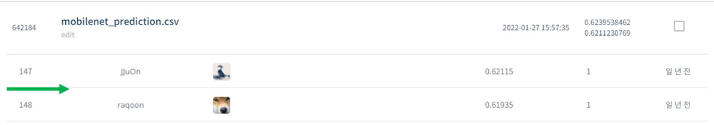
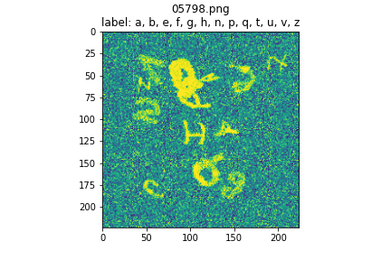

# 제 2회 컴퓨터 비전 학습 경진대회

## 결과

### 요약정보

- 도전기관 : 시큐레이어
- 도전자 : 노민주
- 최종스코어 : 0.6211230769
- 제출일자 : 2022-02-15
- 총 참여 팀 수 : 1067
- 순위 및 비율 : 148(13.89%)

### 결과화면

## 사용한 방법 & 알고리즘

손글씨 이미지를 보고 이미지 속에 합성된 글자를 분류하는 대회이다.

### DATA

train image는 50000장 있다. dirty_mnist_2nd_answer.csv에 train이미지에 대한 정답이 존재한다. 

이미지에 알파벳이 존재할 경우 1, 존재하지 않을 경우 0이다.

한 이미지에 10~15개의 알파벳이 존재하므로 multi-label classification이다.

Label은 총 26가지이다. (알파벳 a-Z)

test image는 총 5000장이다.

- Train image augmentation : 원본이미지 사이즈는 (256,256)이다. 이미지 알파벳이 무작위로 크기와 각도를 조절하였으므로, Flip과 RandomRotation을 사용하여 augmentation을 진행하였다.

### Model
- Mobilenet + classifier

- K-fold

## 코드
['제2회_컴퓨터_비전_학습_경진대회.ipynb'](./제2회_컴퓨터_비전_학습_경진대회.ipynb)

## 참고 자료
