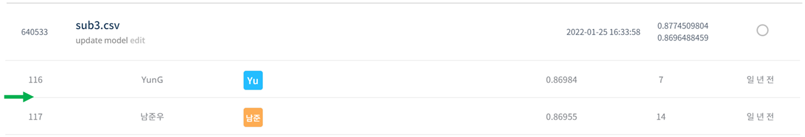
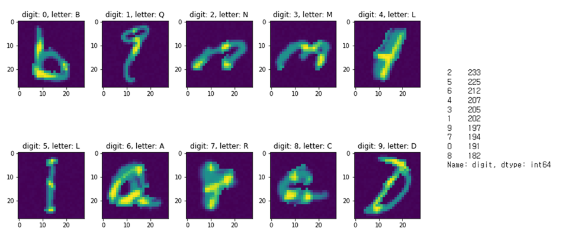
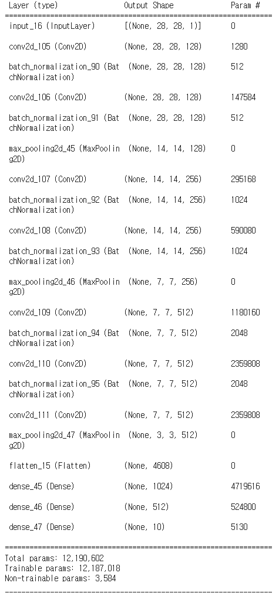

# 컴퓨터 비전 학습 경진대회

## 결과

### 요약정보

- 도전기관 : 시큐레이어
- 도전자 : 노민주
- 최종스코어 : 0.8696488459
- 제출일자 : 2022-02-07
- 총 참여 팀 수 : 1256
- 순위 및 비율 : 117(9.33%)

### 결과화면

## 사용한 방법 & 알고리즘

mnist 변형 데이터 속에 숨겨진 숫자를 찾는 대회이다.

### DATA

train.csv에 id, digit, letter, 그리고 28x28 사이즈의 이미지가 있다. train 이미지는 2048개 존재한다.

train 이미지는 2048개 존재한다. 숫자 별 이미지 개수는 고르게 분포한다.

Label은 총 0부터 9까지 총 10가지이다.

test.csv에는 id, letter, 28x28 사이즈의 이미지가 있다. test 이미지는 총 20480개 존재한다.

- Train image augmentation : 원본 이미지 사이즈가 작아 augmentation을 진행하지 않았다.

### Model
- Custom Model : 3개의 block을 사용하여 custom model을 구성하였다. (vgg 참고)

## 코드

## 참고 자료
