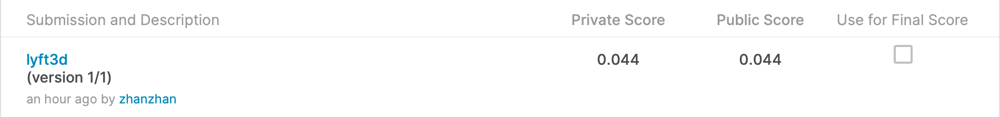

# Lyft 3D Object Detection for Autonomous Vehicles

## 결과

### 요약정보

- 도전기관 : 한얀대학교
- 도전자 : 왕전
- 최종스코어 : 0.044
- 제출일자 : 2021-02-04
- 총 참여 팀 수 : 546
- 순위 및 비율 : 119(21.79%)

### 결과화면

## 사용한 방법 & 알고리즘

Unet 모델을 사용하여 하나의 Unet 완전 볼륨 신경망을 훈련시키고, 깊이가 작은 네트워크를 만들어 훈련과 예측 시간을 줄인다.

먼저 특징층을 메인 줄기 부분으로 얻고, Unet의 메인 줄기 특징 추출부는 VGG와 유사하며, 컬럼과 최대 풀화를 위한 스택이다.

그리고 특징 추출 부분을 강화하면, 우리는 주간부에서 얻은 유효 특징층을 이용하여 위 샘플링할 수 있으며, 특징 융합을 하여 가장 높은 것을 얻을 수 있다. 모든 특징을 융합한 유효 특성층이다.

예측 시 최종적으로 얻어지는 마지막 유효특징층을 이용하여 각각의 특징점을 분류하는 것은 각각의 픽셀점을 분류하는 것과 같다.

## 코드

[code](./lyft3d.ipynb)

