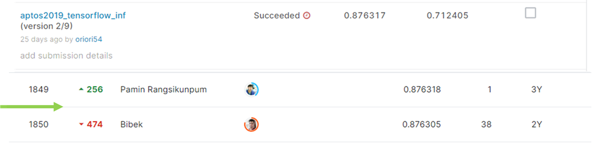
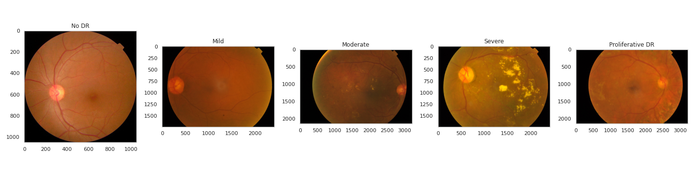
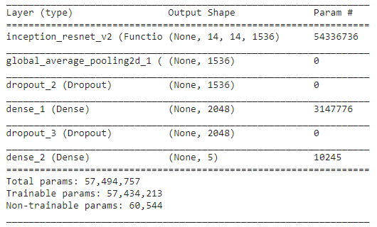

# APTOS 2019 Blindness Detection

## 결과

### 요약정보

- 도전기관 : 시큐레이어
- 도전자 : 노민주
- 최종스코어 : 0.876317
- 제출일자 : 2022-02-11
- 총 참여 팀 수 : 2928
- 순위 및 비율 : 1850(63.18%)

### 결과화면

## 사용한 방법 & 알고리즘

망막 이미지를 보고 당뇨망막병증의 심각도를 0(No DR)부터 4(Proliferative DR)까지 등급을 예측하는 대회이다.

### DATA

train_images 폴더는 3662장의 망막 이미지로 구성되어 있다. train.csv에 각 train 이미지의 라벨이 존재한다. 

라벨은 No DR, Mild, Moderate, Severe, Proliferative DR로 총 5가지이다.

test_images 폴더는 1928장의 망막 이미지로 구성되어 있다. 

- Train image transformation: 원본 이미지의 사이즈가 각각 다르기 때문에 (512,512)로 resize하였다.

### Model
- InceptionResnet

## 코드
[APTOS_2019_Blindness_Detection_inf.ipynb](./APTOS_2019_Blindness_Detection_inf.ipynb)

## 참고 자료
