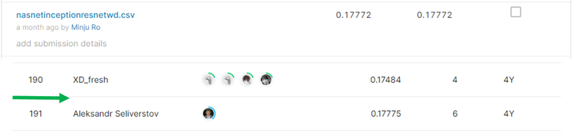
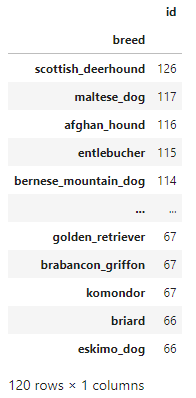

# Dog Breed Identification

## 결과

### 요약정보

- 도전기관 : 시큐레이어
- 도전자 : 노민주
- 최종스코어 : 0.17772
- 제출일자 : 2022-02-08
- 총 참여 팀 수 : 1280
- 순위 및 비율 : 191(14.92%)

### 결과화면

## 사용한 방법 & 알고리즘

이미지 속 강아지의 품종을 분류하는 대회이다.

### DATA

train 폴더 안에 10222장의 이미지가 있다.

label.csv에 각 train 이미지에 대한 강아지 품종이 적혀있다. 강아지 품종은 총 120가지이다. 품종별 이미지 개수는 다르다.

test 폴더 안에 총 10357장의 test 이미지가 있다.

- Train image augmentation : 331X331로 RESIZE

### Model
- NasnetLarge
- InceptionResnet
- weight decay
- ensemble

## 코드
[Dog_Breed_Identification.ipynb](./Dog_Breed_Identification.ipynb)

## 참고 자료
