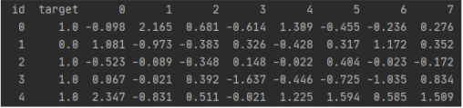

# Don't Overfit!!

## 결과

### 요약정보

- 도전기관 : 시큐레이어
- 도전자 : 문진웅
- 최종스코어 : 0.872
- 제출일자 : 2022-02-10
- 총 참여 팀 수 : 2316
- 순위 및 비율 : 2(1%)

### 결과화면

## 사용한 방법 & 알고리즘

적은 데이터만으로 모델을 만들어 정확도를 높이는 방법 모색

### DATA

train데이터 : 250,302

target은 0,1로 구분되는 이진분류 문제이다

test데이터 : 19750,301

### 전처리
- RobustScaler
- Recursive Feature Elimination(RFECV)
- RepeatedStratifiedKFold
### Model
- Logistic
- Adaboost
- Support Vector Classification(SVC)
- Stochastic Gradient Descent(SGD)
- Lasso
- ExtraTreesClassifier

## 코드
[CleanUp3](./CleanUp3/FinalModel.py)

## 참고 자료
