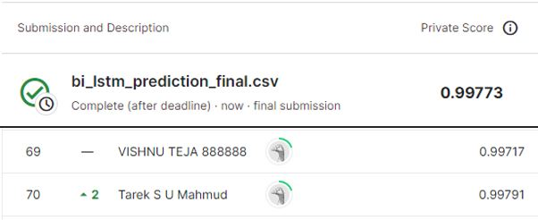

# Football Match Probability Prediction
---
# 결과
---
### 요약 정보
* 도전기관 : 시큐레이어
* 도전자 : 이강민
* 최종 스코어 : 0.99773
* 제출 일자 : 2022-12-20
* 총 참여 팀수 : 382
* 순위 및 비율 : 70 (18.3%)

# 결과 화면
---


# 사용한 방법 & 알고리즘
---
* 결측이 유독 많은 column과 target의 상관관계 파악
* Feature Engineering
	- 날짜 관련 column 타입 object → datetime으로 변경
	- 날짜 기반 feature column 생성
	- validation set 크기를 다양하게 구성
	- "coach" 관련 feature 제외하여 최종 데이터셋 구성
* Bi-LSTM 모델 사용

# 코드
---
[jupyter notebook code](Football_Match_Probability_Prediction_final.ipynb)

# 참고자료
---
##### https://www.tensorflow.org/guide/keras/masking_and_padding?hl=ko
##### https://soccerda.tistory.com/195


```python

```
