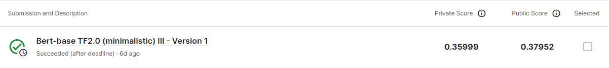
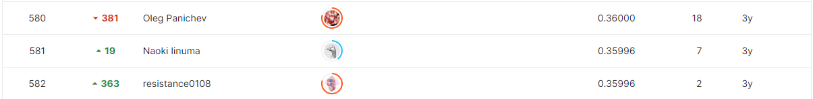

# Google QUEST Q&A Labeling

## 결과

### 요약정보

- 도전기관 : 시큐레이어
- 도전자 : 김준혁
- 최종스코어 : 0.35999
- 제출일자 : 2022-12-07
- 총 참여 팀 수 : 1572
- 순위 및 비율 : 581(36%)

### 결과화면

## 사용한 방법 & 알고리즘
- BERT를 이용한 전처리

## 코드

['QNA_Bert.ipynb'](./QNA_Bert.ipynb)

## 참고 자료
