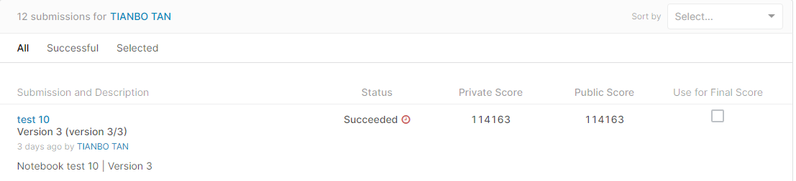

# Hash Code Archive - Drone Delivery

## 결과

### 요약정보

- 도전기관 : 한양대학교
- 도전자 : 탄텐보
- 최종스코어 : 114163
- 제출일자 : 2022-06-13
- 총 참여 팀 수 :130
- 순위 및 비율 : 26(20%)

### 결과화면

## 사용한 방법 & 알고리즘

"무게 거리" 정의
무게 거리는 주문의 "어려움", 즉 이행에 필요한 자원의 양을 나타냅니다. 이 주문을 완전히 배송하기 위해 배송될 각 제품의 제품 중량 단위 * 거리 단위의 합계로 정의합니다.

단일 배송 항공편(경로)에서 쉽게 완료할 수 있는 주문을 위한 번들 제품
배달 일정(경로 조합)을 할당할 때 이 경로에 우선 순위 부여
"쉬운/빠른" 주문을 먼저 완료하고 더 긴 주문은 나중에 완료하기 위해. 실생활 문제에서 이것은 최적화의 완벽한 방법이 아닐 수 있습니다. 우리는 다소 덜 최적화된(그러나 여전히 꽤 좋은) 리소스 활용 비용에 대해 특정 주문을 다른 주문보다 먼저 완료하는 것을 우선시하기 때문입니다(드론은 가능한 한 많이 로드되지 않을 수 있음). 또는 절대적으로 필요한 것보다 조금 더 멀리 이동할 수 있습니다).

### DATA
인터넷은 우리가 물건을 사는 방식을 근본적으로 변화시켰지만 오늘날의 온라인 쇼핑은 그렇지 않을 것입니다.
그 변경의 끝; 우리는 각 구매 후 실제 상품이 도착할 때까지 여전히 며칠을 기다려야 합니다.
우리 문앞까지 운반되었습니다.
무인 항공기가 온라인 구매를 제공하는 자율 전기 자동차로 들어오는 곳입니다. 비행, 그래서 결코
트래픽에 갇혀. 드론 기술이 매년 발전함에 따라 중요한 문제가 남아 있습니다.
모든 무인 항공기를 조정합니까?

가상의 드론 함대, 고객 주문 목록 및 창고에 있는 개별 제품의 가용성이 주어지면 귀하의 임무는 주문이 가능한 한 빨리 완료되도록 드론 작업 일정을 잡는 것입니다. 여러 드론, 고객 주문, 제품 유형 및 중량, 창고 및 배송 목적지의 복잡한 문제를 처리해야 합니다.

이것은 보다 복잡한 최적화 문제이므로 자세한 내용은 데이터 세트의 pdf를 참조하십시오. PDF는 여러 입력 파일의 가능성에 대해 논의하지만 이 경쟁에서는 하나만 사용합니다.

### Model
이 솔루션의 일반적인 프로세스는 매우 간단합니다.

총 배송 거리를 최소화하기 위해 각 제품 단위가 배송되는 위치를 결정합니다. 이것은 창고 사이의 재분배 장치를 사용하지 않습니다. 우리는 단순히 제품이 현재 어디에 있고 어디로 가야 하는지 살펴보고 가능한 가장 직접적인 경로로 제품을 배송하려고 시도합니다. 특정 제품은 하나 또는 두 개의 창고에만 보관되며 지도 전체에 걸쳐 배송해야 할 수도 있습니다.
각 창고에 대해 별도로 실행해야 하는 모든 배송을 살펴보고 가능한 한 효율적으로 단일 배송 경로로 결합하여 적재 활용을 극대화하고 각 경로의 이동 거리를 최소화합니다. 우리는 주문을 "난이도"(즉, 총 중량 및 거리)별로 그룹화하여 더 높은 점수를 얻습니다. 즉, 주문 완료를 위한 전체 대기 시간을 최소화합니다.
모든 창고의 모든 단일 경로를 결합하여 단일 경로의 끝과 다음 경로의 시작 사이의 거리가 가능한 한 가까워지도록 각 드론을 예약하려고 시도합니다(가장 컴퓨팅 집약적인 부분). "쉬운/빠른" 주문이 더 높은 점수를 위해 먼저 완료되도록 단계별로 수행합니다.

## 코드
[test-10.ipynb](./test-10.ipynb)

## 참고 자료
