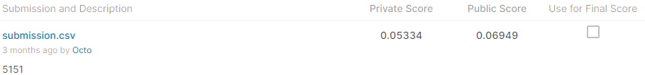
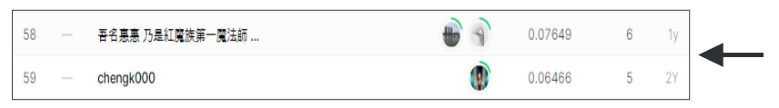

# Herbarium 2020 - FGVC7

## 결과

### 요약정보

- 도전기관 : 시큐레이어
- 도전자 : 문진웅
- 최종스코어 : 0.06949
- 제출일자 : 2022-02-10
- 총 참여 팀 수 : 153
- 순위 및 비율 : 59(37%)

### 결과화면

## 사용한 방법 & 알고리즘

식물 표본을 통해 식물 종 예측

### DATA

train데이터 : 320,000개 이미지 데이터
category는 32093개 데이터로 구분되는 분류 문제이다

특정 카테고리에 몰려있는 데이터

test데이터 : 138,291개 이미지 데이터

###
- 카테고리가 적은 데이터 제거

### Model
- CNN

#### 옵션
- fit_generator
- flow_from_dataframe
- imageDatagenerator를 

## 코드
[Herbarium_2020](./Herbarium_2020.ipynb)

## 참고 자료
