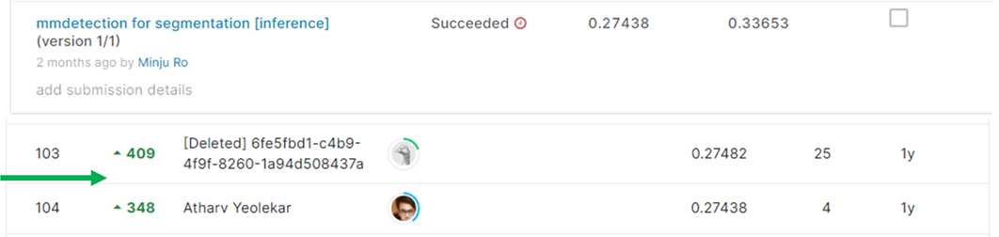
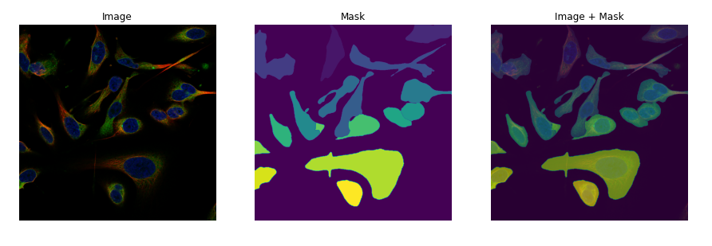
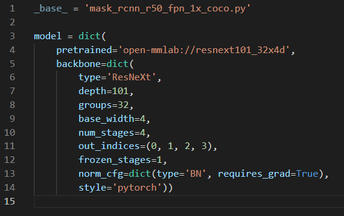

# Human Protein Atlas - Single Cell Classification

## 결과

### 요약정보

- 도전기관 : 시큐레이어
- 도전자 : 노민주
- 최종스코어 : 0.27438
- 제출일자 : 2022-02-21
- 총 참여 팀 수 : 757
- 순위 및 비율 : 104(13.73%)

### 결과화면

## 사용한 방법 & 알고리즘

이미지에 존재하는 각각의 세포에 대해 단백질 위치 라벨을 예측하는 대회이다. 각각의 세포들을 segment하고 그것의 label을 예측하는 instance segmentation으로 해결할 수 있다.

### DATA

train_images 폴더 안에 21806장의 이미지가 있다. 1728x1728, 2048x2048, 3072x3072 사이즈의 이미지들이 섞여 있다.

Label은 총 19가지이다.
(0. Nucleoplasm, 1. Nuclear membrane, 2. Nucleoli, 3. Nucleoli fibrillar center, 4. Nuclear speckles, 5. Nuclear bodies, 6. Endoplasmic reticulum, 7. Golgi apparatus, 8. Intermediate filaments, 9. Actin filaments, 10. Microtubules, 11. Mitotic spindle, 12. Centrosome, 13. Plasma membrane, 14. Mitochondria, 15. Aggresome, 16. Cytosol, 17. Vesicles and punctate cytosolic patterns, 18. Negative)

- mask처리가 된 hpa-mask open dataset을 사용
- mmdetection 사용

### Model
- Mask RCNN
- resnext101_32x4d

## 코드

## 참고 자료
