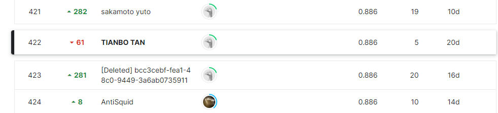

# NBME - Score Clinical Patient Notes

## 결과

### 요약정보

- 도전기관 : 한양대학교
- 도전자 : 탄텐보
- 최종스코어 : 0.886
- 제출일자 : 2022-05-4
- 총 참여 팀 수 : 1500
- 순위 및 비율 : 422(28.13%)

### 결과화면

## 사용한 방법 & 알고리즘

먼저 공개적으로 사용 가능한 모델을 사용하여 predictions_v3_l, predictions_v1_l 및 predictions_v3_b를 계산합니다. 이들은 np.arrays의 목록이다. 각 np.array는 하나의 환자 메모/기능 번호 조합에 해당하며 환자 메모의 n번째 문자가 기능에 속하는 것으로 선택되어야 하는 확률을 나타나다.

### DATA
여기에 제시된 텍스트 데이터는 의료 면허 시험인 USMLE® 2단계 임상 기술 시험에서 가져온 것입니다. 이 시험은 표준화된 환자를 만나는 동안 관련 임상 사실을 인식하는 훈련생의 능력을 측정한다.

이 시험 동안 각 응시자는 임상 사례를 묘사하도록 훈련된 사람인 표준화된 환자를 보게 된다. 환자와 상호 작용한 후 검사자는 환자 메모에 관련 사실을 문서화한다. 각 환자 메모는 루브릭에 설명된 대로 사례와 관련된 특정 핵심 개념 또는 기능의 존재를 찾는 훈련된 의사에 의해 채점돤다. 이 경쟁의 목표는 표준화된 환자와의 인터뷰 정보가 문서화되는 메모의 환자 기록 부분에 특히 중점을 두고 각 환자 메모 내에서 관련 기능을 식별하는 자동화된 방법을 개발하는 것이다.

### Model
Darknet-53의 본체인 yolov3의 백본 부분은 resnet 구조와 유사하며, 여러개의 잔여 모듈이 쌓여 있으며, 잔여 모듈 사이에는 kernel_size=3x3, stride=2 컨볼루션 레이어가 있으며 주요 기능은 다운샘플링, 그리고 53은 전체를 나타냅니다. 백본은 총 52개의 컨볼루션 레이어와 마지막 연결 레이어(full connection 레이어), 총 53개의 레이어 구조를 가지고 있습니다. 다음 그림은 256 x 256 입력 이미지를 기반으로 소개, 일반적으로 사용되는 크기는 416 x 416, 모두 32의 배수입니다. 그것은 2 5 = 32 2^5=322
5=32).

## 코드
[deberta-v3-large-0-883-lb.ipynb](./deberta-v3-large-0-883-lb.ipynb)

## 참고 자료
