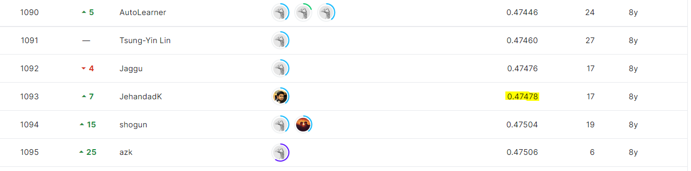

# Otto Group Product Classification Challenge

# 결과

### 요약정보

- 도전기관 : 시큐레이어
- 도전자 : 문일주
- 최종스코어 : 0.47478
- 제출일자 : 2022-12-01
- 총 탐여 팀 수 : 3507
- 순위 및 비율 : 1093 (31.16%)

# 결과화면

# 사용한 방법 & 알고리즘
- XGBoost 모델 

# 코드
[code](./otto-group-product-classification-challenge.ipynb)

# 참고자료

