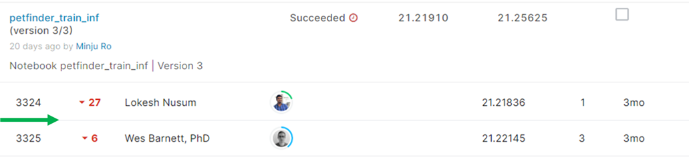
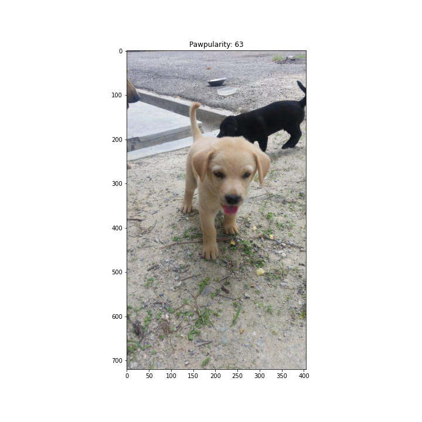
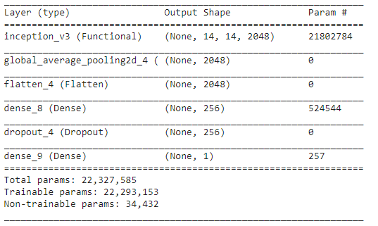

# PetFinder.my - Pawpularity Contest

## 결과

### 요약정보

- 도전기관 : 시큐레이어
- 도전자 : 노민주
- 최종스코어 : 21.25625
- 제출일자 : 2022-02-16
- 총 참여 팀 수 : 3537
- 순위 및 비율 : 3325(94.00%)

### 결과화면

## 사용한 방법 & 알고리즘

강아지 사진 및 정보를 보고 pawpularity를 예측하는 대회이다.

### DATA

train 이미지는 총 9912장 존재한다. train.csv에는 이미지에 대한 pawpularity뿐만 아니라, subject focus, eyes, face, near, action, accessory, group, collage, human, occlusion, info, blur의 metadata도 포함되어있다.

test폴더 안에는 총 8개의 샘플이미지가 있다. (실제는 6800장의 test 이미지로 구성되어 있다.)

- Train image augmentation : 이미지 사이즈를 모두 (512,512)로 resize, horizontal_flip, vertical_flip

### Model
- InceptionV3 + dense layer + classifier

## 코드
[petfinder_my_pawpularity_contest_train.ipynb](./petfinder_my_pawpularity_contest_train.ipynb)

[petfinder_my_pawpularity_contest_inf.ipynb](./petfinder_my_pawpularity_contest_inf.ipynb)

## 참고 자료
