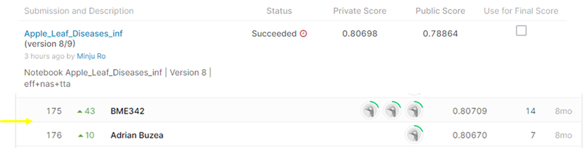

# Plant Pathology 2021 - FGVC8

## 결과

### 요약정보

- 도전기관 : 시큐레이어
- 도전자 : 노민주
- 최종스코어 : 0.80698
- 제출일자 : 2022-01-21
- 총 참여 팀 수 : 626
- 순위 및 비율 : 176(28.11%)

### 결과화면

## 사용한 방법 & 알고리즘

사과 잎 이미지를 보고 질병을 구별하는 대회이다.

### DATA

train_images 폴더 안에 18632장의 이미지가 있다.

train.csv에 각 train image의 label이 있다. 한 이미지에 여러가지 질병을 가진 경우도 존재한다. 따라서 multi label classification으로 해결할 수 있다.

Label은 총 6가지이다. (complex, frog_eye_leaf_spot, healthy, powdery_mildew, rust, scab)

test_images 폴더 안에 총 3개의 샘플이미지가 있다. (실제 5000장의 test image가 있고, 제출하면 결과를 알 수 있다.)

- Train image augmentation : 원본 이미지는 (4000, 2672) 사이즈지만, (512,512)로 resize된 이미지 데이터 사용하여 data_augmentation 진행
- Test Time Augmentation(TTA) : augmentation 진행한 이미지와 원본 이미지 둘 다 inference 후 평균한 결과 성능 향상

### Model
- EfficientNetB7
- NasnetLarge
- ensemble

## 코드
['./Plant Pathology 2021_train.ipynb'](./Plant_Pathology_2021_train.ipynb)

['./Plant Pathology 2021_inference.ipynb'](./Plant_Pathology_2021_inference)

## 참고 자료
