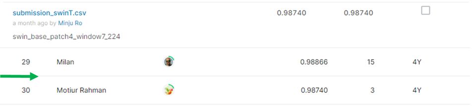

# Plant Seedlings Classification

## 결과

### 요약정보

- 도전기관 : 시큐레이어
- 도전자 : 노민주
- 최종스코어 : 0.98740
- 제출일자 : 2022-02-08
- 총 참여 팀 수 : 833
- 순위 및 비율 : 30(3.60%)

### 결과화면

## 사용한 방법 & 알고리즘

12개의 class로 이루어진 식물 이미지를 분류하는 대회이다.

### DATA

train폴더 안에 식물 이미지가 class별로 12개의 폴더로 나누어져 있다. 총 train 이미지 개수는 4750장이다.

이미지 개수는 class마다 다르다. 
class는 Black-grass, Charlock, Cleavers, Common Chickweed, Common wheat, Fat Hen, Loose Silky-bent, Maize, Scentless Mayweed, Shepherds Purse, Small-flowered Cranesbill, Sugar beet로 총 12가지이다.

test 폴더 안에는 794장의 test이미지가 있다.

- Train image augmentation : swin transformer 모델을 사용하기 위해 224x224로 resize

### Model
- Swin Transformer
- 4-fold 사용

## 코드

## 참고 자료
