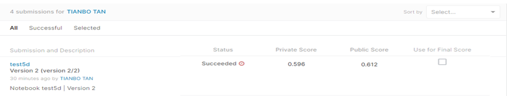

# SIIM-FISABIO-RSNA COVID-19 Detection

## 결과

### 요약정보

- 도전기관 : 한양대학교
- 도전자 : 탄텐보
- 최종스코어 : 0.596
- 제출일자 : 2022-07-29
- 총 참여 팀 수 : 1305
- 순위 및 비율 : 369(28.28%)

### 결과화면

## 사용한 방법 & 알고리즘

추가 주석 파일에는 고유한 StudyInstanceUID가 있는 샘플만 포함되어 있습니다. 나머지 이미지는 선명도가 증가하거나 다른 기능이 추가된 동일한 이미지의 변형이기 때문에 연구당 하나의 이미지만 유지하는 것이 좋다.

### DATA
데이터 정리: 분류 및 탐지를 위해 수동으로 중복 항목을 제거했습니다. 또한 감지를 위해 환자당 하나의 이미지를 촬영하는 대신 주석이 없는 이미지만 제거했습니다. 이러한 이유로 우리의 CV는 대부분의 사람들에 비해 낮았지만 좋은 lb 상관 관계를 가졌습니다.
교차 검증: StratifiedGroupKFold.

### Model
우리는 2cls 모델 하나만 사용했습니다. 더 많은 것을 포함하는 것은 그다지 영향을 미치지 않았습니다.

모델: EfficientNetb7
이미지 크기: 640
외부 데이터: 여기에서 @raddar가 게시한 RICORD 데이터 세트 및 레이블을 사용했습니다. 다른 어노테이터에서 레이블을 가져오기 위해 max-voting을 사용했습니다.

## 코드
[test5d.ipynb](./test5d.ipynb)

## 참고 자료
