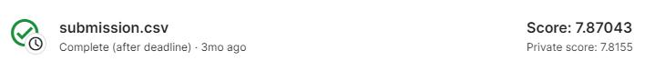

## Tabular Playground Series - Dec 2021

------------

### 결과

----------------

### 결과 요약

* 도전기관 : 한양대학교
* 도전자 : 성영
* 최종스코어 : 7.8155
* 제출일자 : 2022-08-19
* 총 참여 팀 수 : 1755
* 순위 및 비율 :  341(19.43%)

### 리더보드

----------

### 알고리즘

테이블은 전처리되고 시각화됩니다.
회귀 모델과 분류 모델을 사용하여 테이블 처리를 시도했습니다.
마지막으로 가장 성능이 좋은 Catboost Regressor 모델이 선택되었습니다.

-----------

### 코드

['./Untitled-1.ipynb'](Untitled-1.ipynb)

-----------

### 참고자료

[TPS August 2021 EDA & Base Model](https://www.kaggle.com/code/dwin183287/tps-august-2021-eda-base-model) 

