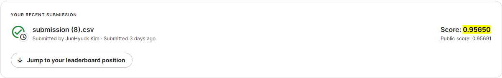
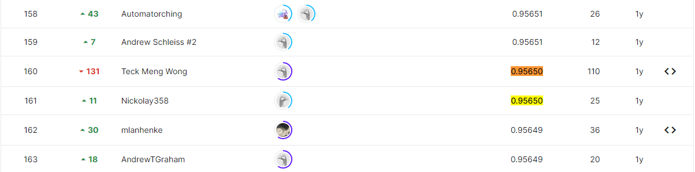

# Tabular Playground Series - Dec 2021

## 결과

### 요약정보

- 도전기관 : 시큐레이어
- 도전자 : 김준혁
- 최종스코어 : 0.95650
- 제출일자 : 2022-12-01
- 총 참여 팀 수 : 1190
- 순위 및 비율 : 160(13%)

### 결과화면

## 사용한 방법 & 알고리즘
- MLP 모델 & K-Fold 기법 사용

## 코드

['TPS_Dec.ipynb'](./TPS_Dec.ipynb)

## 참고 자료
