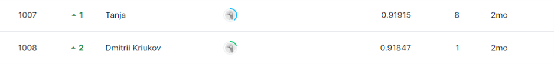

## Tabular Playground Series - Dec 2021

------------

### 결과

----------------

### 결과 요약

* 도전기관 : 시큐레이어
* 도전자 : 허인
* 최종스코어 : 9.1704
* 제출일자 : 2022-02-08
* 총 참여 팀 수 : 1188
* 순위 및 비율 :  1009(84.93%)

### 리더보드

----------

### 알고리즘

DecisionTree Classifier
* 정의
  * 지도 학습 머신러닝 알고리즘
  * 요소: node, edge, root, leave
  
* 장점
  * 시각화
    - 모델 시각화: 알고리즘의 decision을 한 눈에 살필 수 있음
    - 타 알고리즘이 대부분 블랙박스로 작동하지만, DecisionTree Classifier의 경우 판단의 이유를 파악 가능
  * Data Robustness
    - 다른 type의 데이터를 다루는데에 유리 (numerical & categorical) - categorical 데이터에 대한 encode 작업을 할 필요 없음
* 주요 parameter
  * criterion: gini, entropy - default: gini
    - split의 quality를 측정하는 함수: gini는 gini impurity, entropy는 information gain
  * splitter: best, random - default: best
    - node에서 split을 어떠한 방식으로 선택하는가: best는 best split을 선택하는 것, random는 무작위의 best split을 선택하는 것

-----------

### 코드

['./Tabular Playground Series - Dec 2021.ipynb](https://github.com/gjdls01/seculayer_challenge3/blob/main/kaggle/Tabular%20Playground%20Series%20-%20Dec%202021/Tabular%20Playground%20Series%20-%20Dec%202021.ipynb)

-----------

### 참고자료

[DeicisionTree Classifier - 정의](https://www.analyticsvidhya.com/blog/2021/04/beginners-guide-to-decision-tree-classification-using-python/) 
[DeicisionTree Classifier - 장점](https://towardsdatascience.com/decision-tree-classifier-explained-in-real-life-picking-a-vacation-destination-6226b2b60575#:~:text=Decision%20Tree%20Classifier%20explained%20in%20real-life%3A%20picking%20a,make%20decisions%2C%20similarly%20to%20how%20humans%20make%20decisions.) 
[DeicisionTree Classifier - 파라미터](https://scikit-learn.org/stable/modules/generated/sklearn.tree.DecisionTreeClassifier.html)

