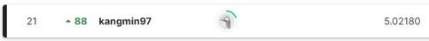

# Tabular Playground Series - Sep 2022
---
# 결과
---
### 요약 정보
* 도전기관 : 시큐레이어
* 도전자 : 이강민
* 최종 스코어 : 5.02180
* 제출 일자 : 2022-09-29
* 총 참여 팀수 : 1381
* 순위 및 비율 : 21 (1.5%)

# 결과 화면
---


# 사용한 방법 & 알고리즘
---
* 시계열 데이터의 경향성 및 계절성 파악
* 계절성과 관련된 feature 도출하여 train/test set 구성
* 선형회귀 계열 모델(Linear Regression, Ridge, Lasso, ElasticNet) 사용

# 코드
---
# 참고자료
---
##### https://www.kaggle.com/code/cabaxiom/tps-sep-22-eda-and-linear-regression-baseline


```python

```
