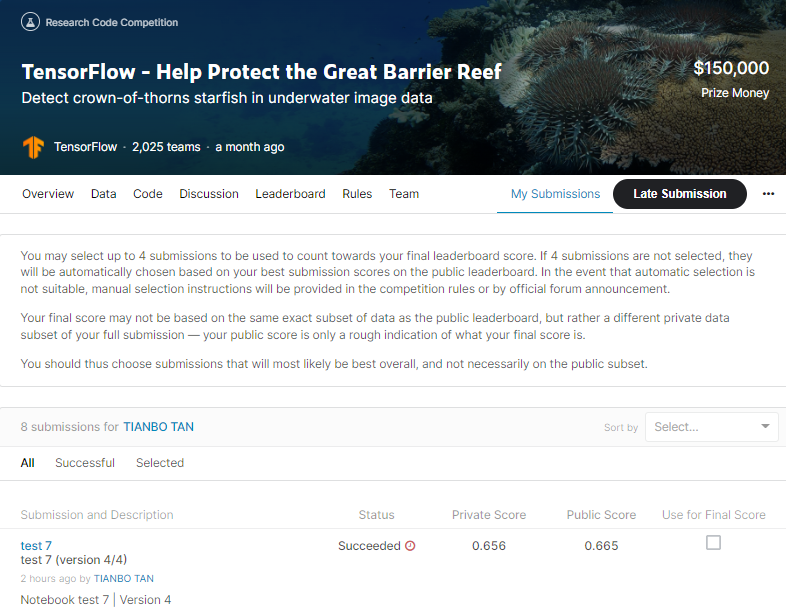

# TensorFlow - Help Protect the Great Barrier Reef

## 결과

### 요약정보

- 도전기관 : 한양대학교
- 도전자 : 탄텐보
- 최종스코어 : 0.656
- 제출일자 : 2022-03-18
- 총 참여 팀 수 : 2025
- 순위 및 비율 : 245(12.09%)

### 결과화면

## 사용한 방법 & 알고리즘

제공된 Python 시계열 API를 사용하여 예측을 제출해야 하므로 이 대회는 이전 개체 감지 대회와 다르다.
각 예측 행에는 이미지의 모든 경계 상자가 포함되어야 합니다. 제출 형식은 [x_min, y_min, 너비, 높이]를 의미하는 COCO인 것 같다.
Copmetition 메트릭 F2는 불가사리를 거의 놓치지 않도록 하기 위해 일부 FP(가양성)를 허용합니다. 이는 위음성(FN)을 다루는 것이 위양성(FP)보다 더 중요하다는 것을 의미한다.

### DATA
train_images/ - video_{video_id}/{video_frame}.jpg 형식의 트레이닝 세트 사진이 포함된 폴더입니다.

[train/test].csv - 이미지의 메타데이터입니다. 다른 테스트 파일과 마찬가지로 대부분의 테스트 메타데이터 데이터는 제출 시 노트북에서만 사용할 수 있습니다. 처음 몇 행만 다운로드할 수 있습니다.

video_id - 이미지가 속한 비디오의 ID 번호입니다. 비디오 ID는 의미 있는 순서가 아닙니다.

video_frame - 비디오 내 이미지의 프레임 번호입니다. 다이버가 수면 위로 올라왔을 때부터 프레임 번호에 간헐적인 차이가 있을 수 있습니다.

시퀀스 - 주어진 비디오의 공백 없는 하위 집합의 ID입니다. 시퀀스 ID는 의미 있게 정렬되지 않습니다.

sequence_frame - 주어진 시퀀스 내의 프레임 번호.

image_id - {video_id}-{video_frame} 형식의 이미지 ID 코드

주석 - Python으로 직접 평가할 수 있는 문자열 형식의 모든 불가사리 감지 경계 상자입니다. 제출할 예측과 동일한 형식을 사용하지 않습니다. test.csv에서는 사용할 수 없습니다. 바운딩 박스는 픽셀 단위의 너비 및 높이와 함께 이미지 내 왼쪽 하단 모서리의 픽셀 좌표(x_min, y_min)로 설명됩니다 --> (COCO 형식).

### Model
트랜스포머 모델의 핵심 아이디어는 셀프 어텐션 메커니즘(self-attention) - 시퀀스의 표현을 계산하기 위해 입력 시퀀스의 다른 위치에 주의를 기울이는 기능입니다. Transformer는 아래의 Scaled dot product Attention 및 Multi-head Attention 섹션에서 다루는 여러 self-attention 레이어의 스택을 생성합니다.

## 코드
[reef-v4-1-pb-0-650-2cb1e2.ipynb](./reef-v4-1-pb-0-650-2cb1e2.ipynb)

## 참고 자료
