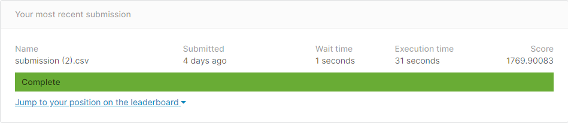
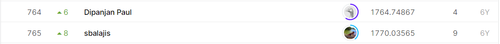

## The Winton Stock Market Challenge

------------

### 결과

----------------

### 요약정보

* 도전기관 : 시큐레이어
* 도전자 : 허인
* 최종스코어 : 1769.89707
* 제출일자 : 2021
* 총 참여 팀 수 : 829
* 순위 및 비율 :  765(92%)

### 결과화면

----------

### 사용한 방법 & 알고리즘

* d
  * d
  * d

* d
  * d

-----------

### 코드

-----------

### 참고자료

