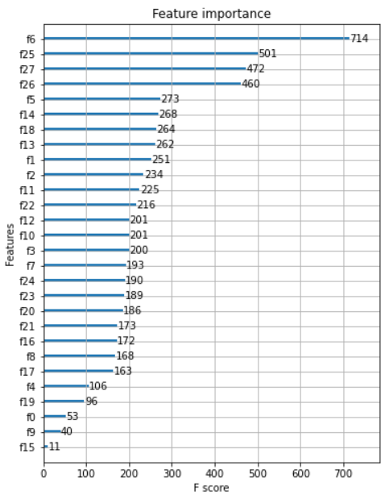

## The Winton Stock Market Challenge

------------

### 결과 요약

* 도전기관 : 시큐레이어
* 도전자 : 허인
* 최종스코어 : 1769.89707
* 제출일자 : 2021-12-30
* 총 참여 팀 수 : 829
* 순위 및 비율 :  765(92%)

### 리더보드 이미지

----------

### 알고리즘 & 문제 해결 방법

1. 알고리즘: XGBoost (Extreme Gradient Boosting)
  * Boosting 기법을 이용하여 구현한 알고리즘 - 병렬 학습이 지원되도록 구현한 라이브러리 (병렬: 수행시간이 짧음)
    - Boosting: 성능이 높지 않는 여러 모델을 조합하여 사용하는 앙상블 기법
                (성능이 낮은 예측 모형들의 학습 에러에 가중치를 두고, 순차적으로 다음 학습 모델엘 반영해 강한 예측모형 생성)
  * Regression, Classification 문제를 모두 지원하는 등 매우 효율적이며 유연
  * overfit regularization - early stopping 제공 / 결측치 내부적으로 처리
    - train 횟수(epoch의 수)가 증가함에 따라 train data에 대한 error는 감소하지만, overfit이 일어나게 됨 -> 모델의 일반화 성능은 감소
    - early stopping: 이전 epoch과 비교하여 오차 증가할 경우 학습 중단
  
2. 문제 해결 방법
  * Feature select (XGBoost 이용): feature 개수가 많을 때 XGBoost를 활용하면 overfit을 초래하지 않게 됨
    

-----------

### 코드

-----------

### 참고자료
[XGBoost](https://xgboost.readthedocs.io/en/stable/tutorials/model.html)
(https://www.sciencedirect.com/science/article/pii/S2090447921000125)

