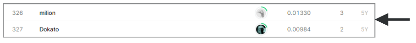

# Transfer Learning on Stack Exchange Tags

## 결과

### 요약정보

- 도전기관 : 시큐레이어
- 도전자 : 문진웅
- 최종스코어 : 0.01330
- 제출일자 : 2022-02-10
- 총 참여 팀 수 : 380
- 순위 및 비율 : 326(85%)

### 결과화면

## 사용한 방법 & 알고리즘
글 분석하여 주제 여러 주제 예측

### DATA

train데이터 : 67,721개 텍스트 데이터
bio, cooking, crypto, diy, robotics, travel의 대분류 데이터에서 주제가 다양하게 나옴
content는 html 태그가 있어 제거
category는 32093개 데이터로 구분되는 분류 문제이다

특정 카테고리에 몰려있는 데이터

test데이터 : 81,926개 텍스트 데이터

### 전처리
- 증분학습이라 카테고리는 학습시 사용 x
- 소문자 전환 및 특수만자 숫자 제거
- word2vec

### Model
- DNN
- BERT tuning
- KeyBERT

## 코드
[stack_bert_word2vec](./stack_bert_word2vec.ipynb)
[stack_keras](./stack_keras.ipynb)
[stack_keybert_keras](./stack_keybert_keras.ipynb)

## 참고 자료
