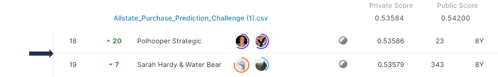

# allstate-purchase-prediction-challenge

## 결과 요약
도전기관 : 시큐레이어    
도전자 : 엄현빈     
최종스코어 : 0.53584     
제출일자 : 2022-04-18      
총 참여 팀 수 : 1566      
순위 및 비율 : 19(1.21%)      

## 결과 화면

## 문제 설명, 해결 방법
### 목표
고객의 견적 내역을 사용하여 차량 보험 옵션 구매 예측

### 문제 해결 방법
1. 옵션 중요도 -> A~G옵션 중 G옵션에 따라 최종 구매에 유의한 영향을 준다고 판단 -> G옵션 집중 분석
2. G별 가격 평균, G & State별 가격 평균, 이전 shopping point에서의 G값 등 G에 관련된 파생변수 생성
3. 차량 나이 대비 가격, 보장 인원 대비 가격, State 대비 가격 등 G와 관련없는 파생변수 생성
4. RandomForest 모델 사용

## 코드
[allstate-purchase-prediction-challenge](https://github.com/Umhyunbin/AutoAPE-challenge3/blob/fcea50c2698870e35535d592fe803b9e9ee9a756/kaggle/allstate-purchase-prediction-challenge/allstate-purchase-prediction-challenge.ipynb)

