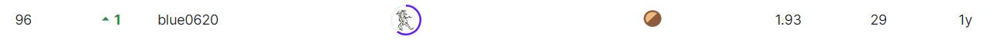
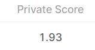

# Bristol-Myers Squibb – Molecular Translation

## 결과 요약
도전기관 :한양대학교   
도전자 : 장이완     
최종스코어 : 1.93     
제출일자 : 2022-07-22      
총 참여 팀 수 : 874      
순위 및 비율 : 96(10.98%)      

## 결과 화면

## 문제 설명, 해결 방법
### 목표
낡은 화학 이미지를 해독 Bristol-Myers Squibb에서 생성된 대량의 합성 이미지 데이터에 접근하여 이미지를 InChI 텍스트 주석의 기초 화학 구조로 변환

### 문제 해결 방법
이 조합에서 5개의 다른 제출을 사용했는데 모두 하나의 모델이 서로 다른 훈련 검사점에서 제출한 것이다.조립 배후의 개념은 하나의 모델을 훈련하면 전체적인 점수를 높일 수 있다는 것이다

## 코드
[Bristol-Myers Squibb – Molecular Translation](./bms-submissions.ipynb)

