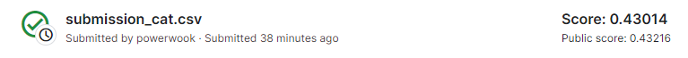
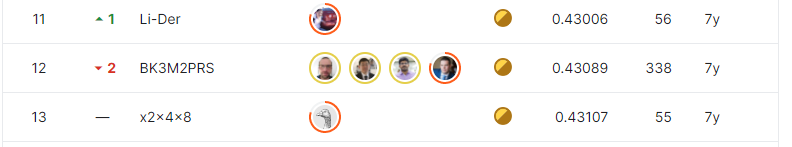

# bnp-paribas-cardif-claims-management

## 결과

### 요약정보

- 도전기관 : 시큐레이어
- 도전자 : 김현욱
- 최종스코어 : 0.430
- 제출일자 : 2022-11-28
- 총 참여 팀 수 : 2920
- 순위 및 비율 : 12(0.41%)

### 결과화면

## 문제 설명, 해결 방법

### 목표
보험사 고객의 클레임 확률 예측

### 문제 해결 방법
xfeat 라이브러리를 활용한 피처엔지니어링

catboost 모델 사용

## 코드
[code](./bnp.ipynb)

## 참고 자료