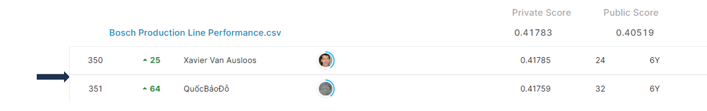

# bosch-production-line-performance

## 결과 요약
도전기관 : 시큐레이어    
도전자 : 엄현빈     
최종스코어 : 0.41783     
제출일자 : 2022-05-12      
총 참여 팀 수 : 1370      
순위 및 비율 : 351(25.62%)      

## 결과 화면

## 문제 설명, 해결 방법
### 목표
생산 라인을 통과하는 부품 중, 품질 관리에 실패할 부품 예측

### 문제 해결 방법
이 프로젝트의 경우 feature engineering, highly imbalanced ground truth -> 2가지 주요 관점 존재
1. 968개의 feature중, Xgboost의 feature importance(f-score 기준)를 통해 100개 feature 추출
2. Station마다 NaN이 제일 적은 Date 추출.
3. 52개의 Station중, 부품별 start station, end station 등 파생변수 생성
4. target 변수인 response의 불균형(1,176,868 vs 6,879)을 해소하기 위해 response : 0 data 추출 후 downsampling
5. RandomForest 모델 이용

## 코드
[bosch-production-line-performance](https://github.com/Umhyunbin/AutoAPE-challenge3/blob/4c38a57c1b8660105fb290ee5c0cd9d17454f119/kaggle/bosch-production-line-performance/bosch-production-line-performance.ipynb)

