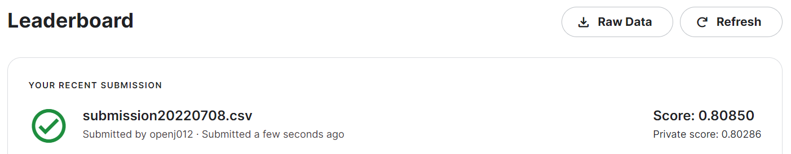
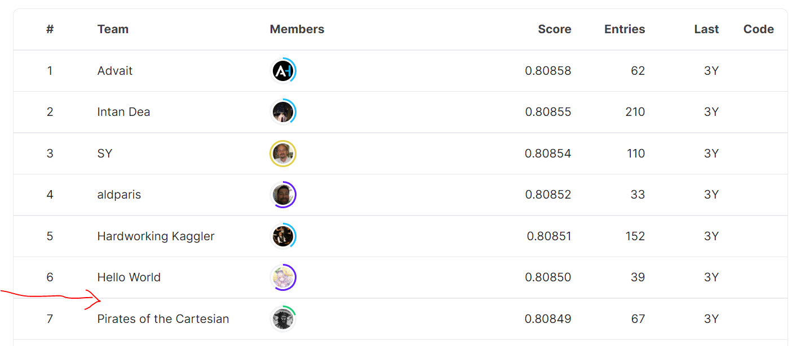

### 요약정보 
- 도전기관 : 한양대 
- 도전자 : 김현주 
- 최종스코어 :  0.80850
- 제출일자 : 2022-07-08
- 총 참여 팀수 : 1338
- 순위 및 비율 : 7(0.05%)

### 결과화면 
 
 

### 사용한 방법 & 알고리즘 
- Feature 의 종류 
binary features
low- and high-cardinality nominal features
low- and high-cardinality ordinal features
(potentially) cyclical features
- 4가지의 Feature를 가공하고,  Binary classification  하는 문제임 
- binary feature, nominal feature 는 Scikit-learn의 Label Encoding을 사용하여 Feature 를 가공함 
- ordial feature 는 OridnaryEncoding 을 통하여 가공함 
- Logistic Regression / lightGBM을 사용하여 모델링함 
- Baysian optimization 을 이용하여 parameter tuning 함 
