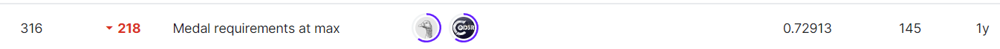

#chaii-hindi-and-tamil-question-answering
## 결과

### 요약정보

- 도전기관 : 한양대학교
- 도전자 : 장이완
- 최종스코어 : 0.72913
- 제출일자 : 2022-11-09
- 총 참여 팀 수 : 894
- 순위 및 비율 : 316(35.34%)

### 결과화면

## 사용한 방법 & 알고리즘

Transformer tokenizerAPI는 데이터를 전처리하는 데 사용되며 CNN 네트워크는 모델을 훈련하는 데 정의된다.

## 코드
[combined-model.ipynb](./combined-model.ipynb)

## 참고 자료
