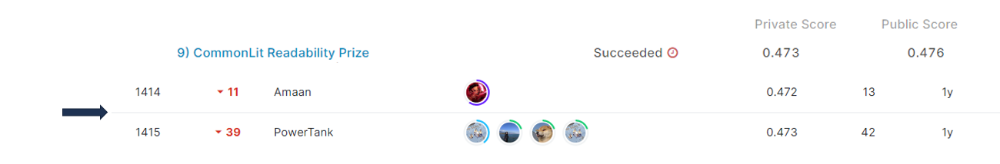

# commonlitreadabilityprize

## 결과 요약
도전기관 : 시큐레이어    
도전자 : 엄현빈     
최종스코어 : 0.473     
제출일자 : 2022-06-02      
총 참여 팀 수 : 3638      
순위 및 비율 : 1415(38.89%)      

## 결과 화면

## 문제 설명, 해결 방법
### 목표
제시된 글(3-12학년 교실에서 사용하는 지문)의 복잡성(읽기 용이성) 예측

### 문제 해결 방법
1. 데이터 전처리 하지 않음(개행문자 제거 시 성적 하락)
2. Optimizer 구현(12개 layer 기준으로 3등분하여 learning rate 증가)
3. rmse에 따라 모델 평가 주기 조절. rmse를 기준으로 model parameter 갱신
4. RoBERTa 모델 사용

## 코드
[commonlitreadabilityprize](https://github.com/Umhyunbin/AutoAPE-challenge3/blob/155664bdd4353481c9f4f5ebfcd5960327e2ea5a/kaggle/commonlitreadabilityprize/commonlitreadabilityprize.ipynb)
