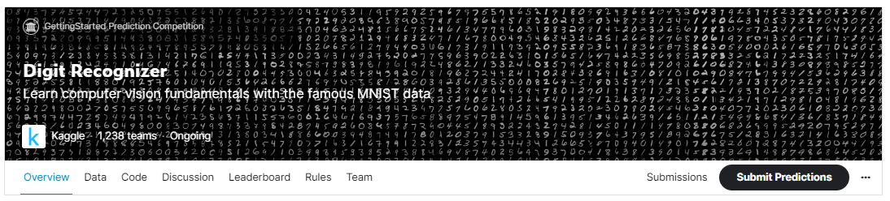
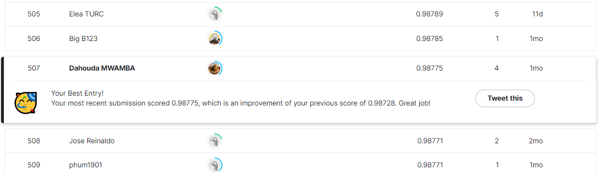

# Digit Recognizer

## 결과

### 요약정보

- 도전기관 : 한양대학교
- 도전자 : MWAMBA KASONGO Dahouda
- 최종스코어 : 507
- 제출일자 : 2022-11-03
- 총 참여 팀 수 : 1785
- 순위 및 비율 : 507(28.40%)

### 결과화면

## 사용한 방법 & 알고리즘

간단한 뉴럴 네트워크 모델을 사용했습니다.

Data Preprocessing

- Converting Training and Testing subset to numpy

Creating tensorflow dataset objects to feed data into keras models

 -- This allows to reduce the images pixels values in range of -1, 1.

## 코드

[`./digit-recog-vit.ipynb`](./digit-recog-vit.ipynb)

## 참고 자료

