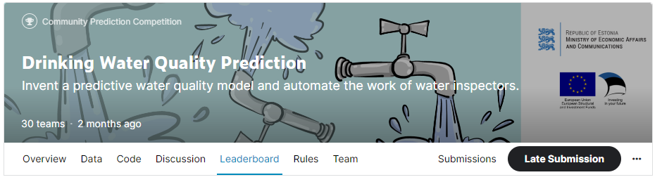
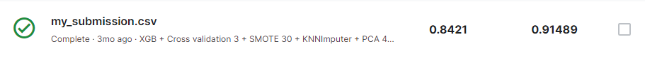
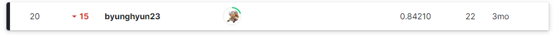

# Drinking Water Quality Prediction

## 결과

### 요약정보

- 도전기관 : 한양대학교
- 도전자 : 김병현
- 최종스코어 : 0.84210
- 제출일자 : 2022-09-21
- 총 참여 팀 수 : 30
- 순위 및 비율 : 20(67.00%)

### 결과화면

## 사용한 방법 & 알고리즘

XGBClassifier + Cross validation + SMOTE + KNNImputer + PCA + MinMaxScaling

## 코드
[`./run.py`](./run.py)

## 참고 자료

