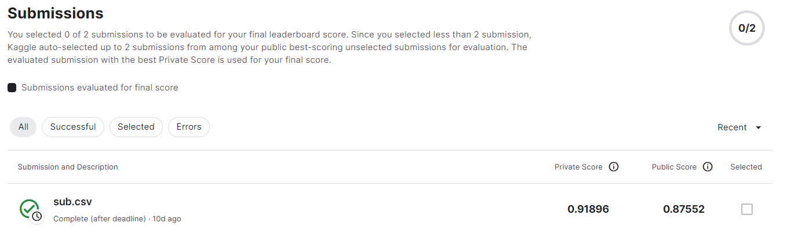
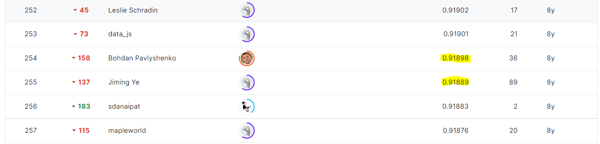

# Facebook IV: Predicting Check Ins
## 결과
### 요약정보
- 도전기관: 시큐레이어
- 도전자: 문일주
- 최종스코어: 0.918
- 제출일자: 2022-12-01
- 총 참여 팀수: 983
- 순위 및 비율: 255(25.94%)
### 결과화면

## 사용한 방법 & 알고리즘
 - RandomForestClassifier 모델
## 코드
[code](./facebook-iv-predicting-check-ins.ipynb)
